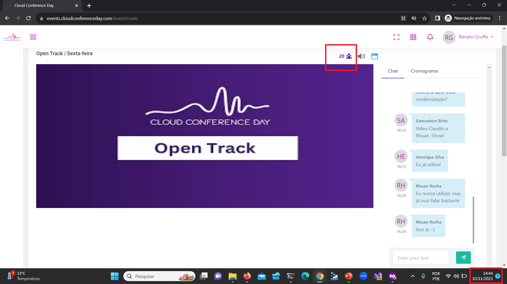
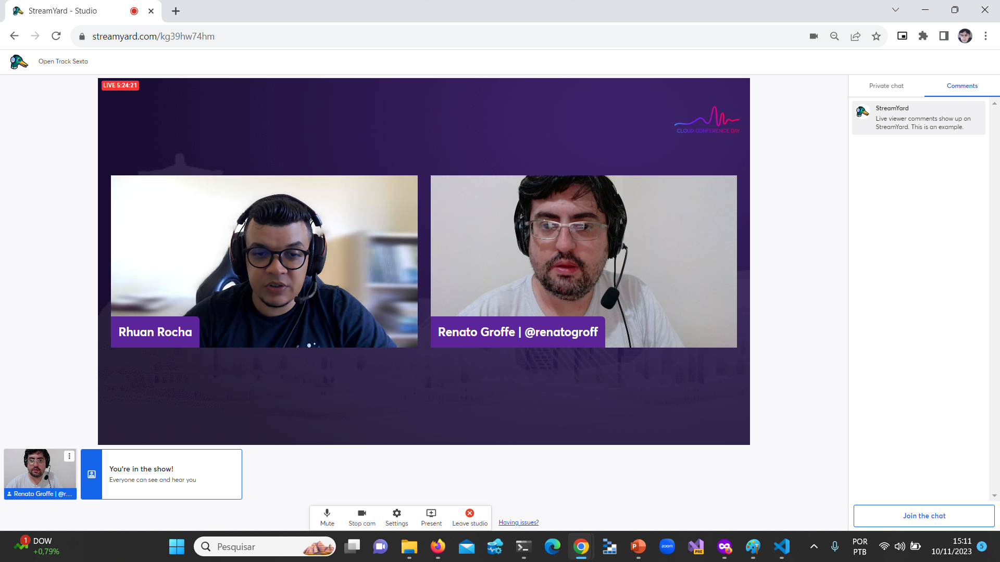
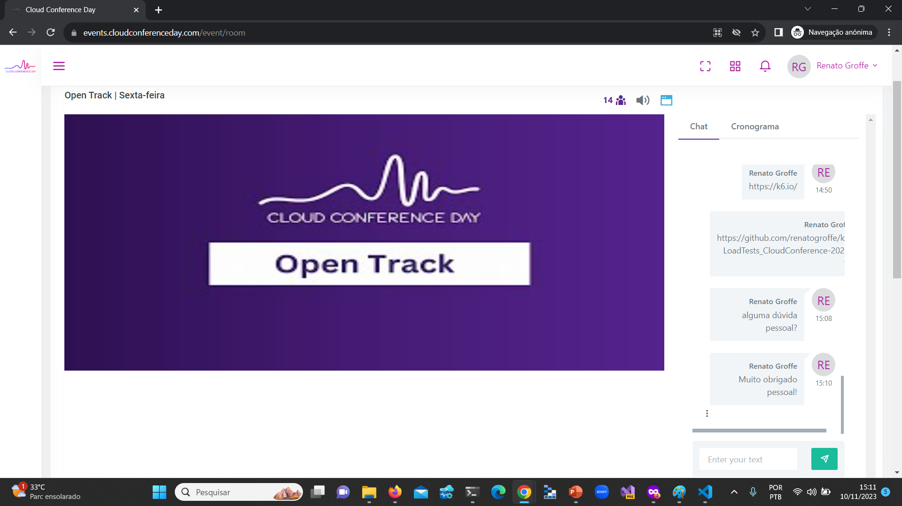

# k6-LoadTests_CloudConference-2023-11
Exemplos de implementação e utilização do k6 para testes de carga de uma API REST.

---

Título da Apresentação: **k6: descomplicando seus testes de carga e de performance**

Data: **10/11/2023 (sexta-feira)**

Tipo do evento: **Online**

Ferramenta de transmissão: **Streamyard**

Tecnologias utilizadas: **k6, JavaScript, JWT, .NET 7, ASP.NET Core, Linux, Azure DevOps, Azure Pipelines, Azure Repos, Visual Studio Code**

Número de participantes: **20 pessoas (pico de audiência ao longo da live)**

Link do evento: [**LinkedIn**](https://www.linkedin.com/posts/cloud-conference-day_come%C3%A7ando-agora-na-open-track-bora-l%C3%A1-activity-7128793110007980032-8Cyc?utm_source=share&utm_medium=member_desktop)

Site do evento: **https://www.cloudconferenceday.com/**

Deixo aqui meus agradecimentos à **Bruna Grellt** e ao **Rhuan Rocha** por todo o apoio para que eu partipasse como palestrante de mais uma edição do **Cloud Conference**.

---

